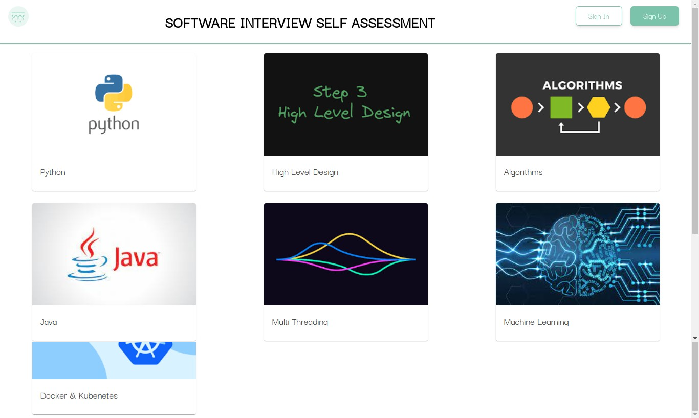
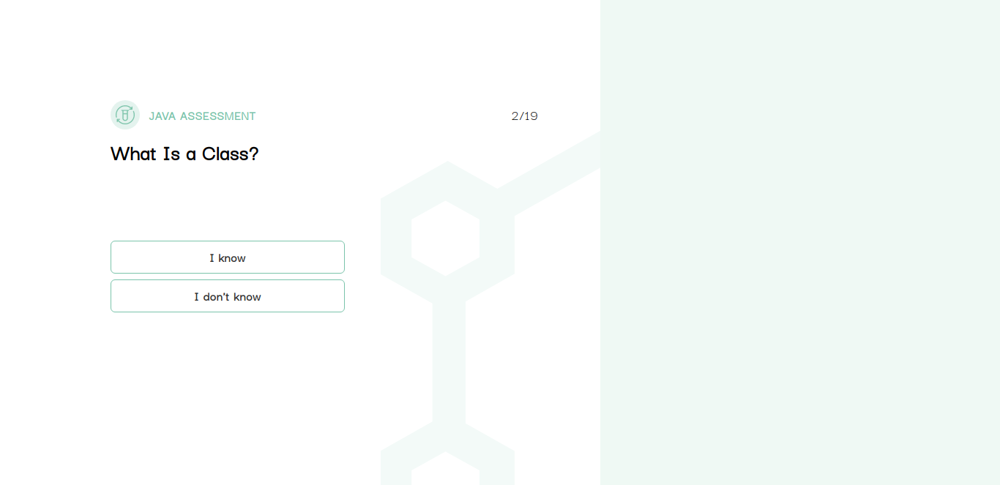
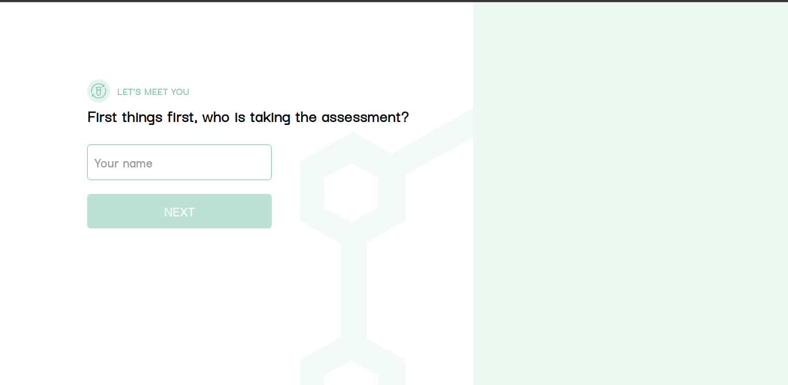

A web application to assess user's knowledge of programming languages and offer recommendations.

##### Clone repo
 - ```git clone https://github.com/Joblyn/Programming-Langs-app.git```

#### Install npm
 - ``` npm install ```

#### Run application
- ``` npm start ```

### Deploymen (heroku)
-```git add .
    git commit -m <your comment>
    git push heroku main
    ```




