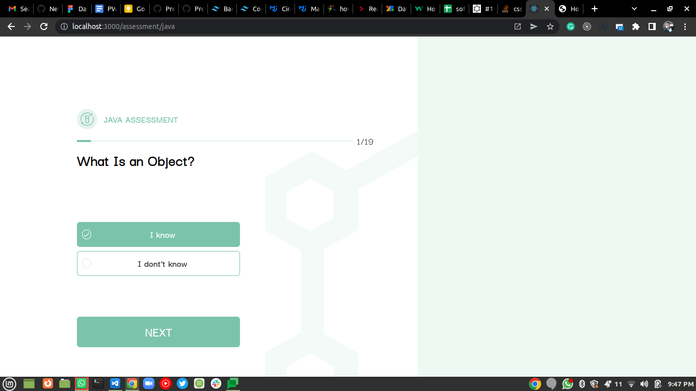
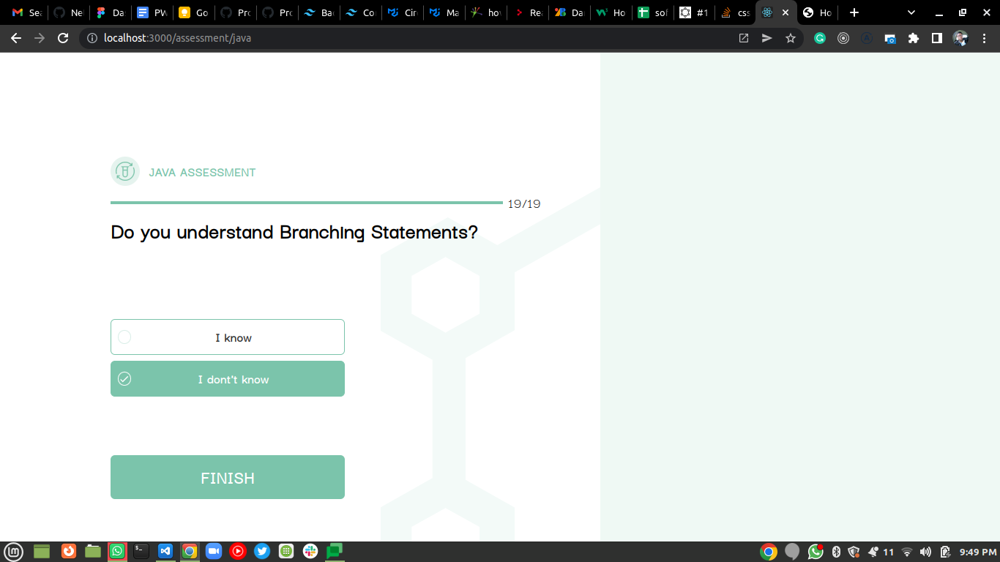
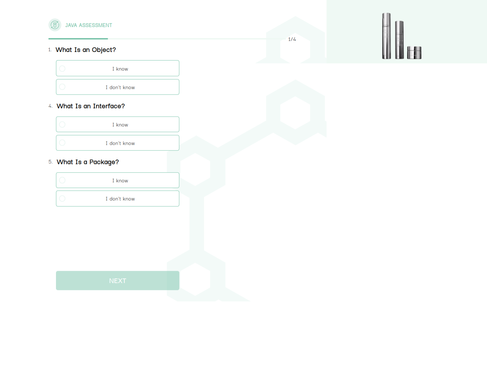

Programming-Langs-App
====================================================
A web application to assess user's knowledge of programming languages and offer recommendations.


Development
-----------
##### Clone repo
 - ```git clone https://github.com/Joblyn/Programming-Langs-app.git```

#### Install npm
 - ``` npm install ```

#### Run application
- ``` npm start ```

### Project tools
- Language => Javascript
- Framework => ReactJS 
- State Management => Redux tool kit
- HTTP Interface client => Axios
- Design => Material UI || Tailwind

### Deployment (heroku)
-----------
- `git add .`               
-  `git commit -m <your comment>`             
- `git push heroku main`
    
    
<!-- 
 -->

